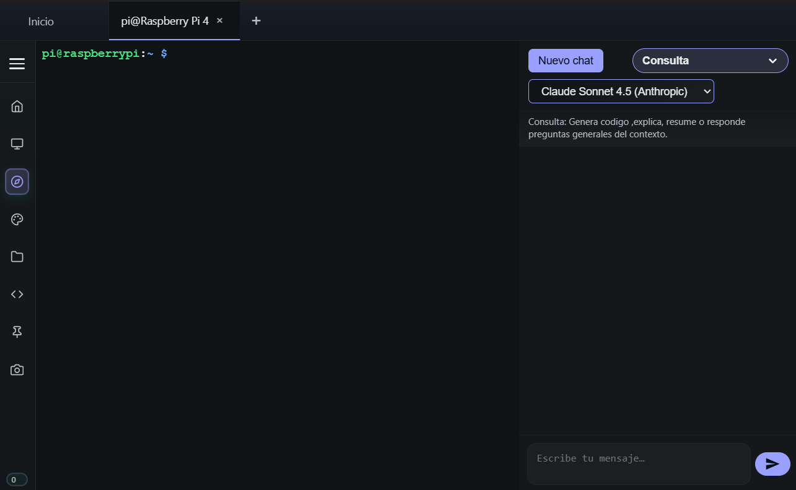

# Cliente Rust SSH/SFTP con IA y Control de Raspberry Pi

Este proyecto es una aplicación de escritorio de última generación diseñada para la gestión remota de sistemas, con un enfoque especial en la educación y el control de dispositivos IoT como Raspberry Pi. Combina la potencia y seguridad de **Rust** en el backend con una interfaz moderna en **React**.

## Descripción

La aplicación ofrece una solución integral para administradores de sistemas, profesores y estudiantes. No solo permite conexiones SSH y transferencias SFTP seguras, sino que integra un **Agente de Inteligencia Artificial** capaz de analizar archivos, sugerir correcciones de código y automatizar tareas complejas directamente en el servidor remoto.

Además, cuenta con módulos específicos para la enseñanza y el control de hardware, permitiendo interactuar visualmente con los pines GPIO de una Raspberry Pi y acceder a su **Escritorio Remoto** de forma fluida.

## Funcionalidades Principales

### Conectividad y Gestión Remota
*   **Cliente SSH Nativo**: Terminal completa con emulación y soporte para sesiones interactivas.
*   **Cliente SFTP Gráfico**: Navegador de archivos remoto con soporte para subir, bajar y gestionar directorios (drag & drop).
*   **Gestión de Hosts**: Almacenamiento seguro (cifrado) de credenciales y direcciones IP.
*   **Escritorio Remoto (VNC)**: Acceso visual al entorno gráfico de la Raspberry Pi mediante un bridge WebSocket-SSH ultra rápido (Xvfb + noVNC).

### Inteligencia Artificial Integrada
*   **Chat Contextual**: Asistente IA que entiende el contexto de tu sesión y archivos.
*   **Análisis de Archivos**: Envía archivos remotos a la IA para obtener explicaciones, búsqueda de bugs o sugerencias de optimización.
*   **Edición Remota Asistida**: La IA puede proponer y aplicar cambios directamente en los archivos del servidor (Plan & Apply).

### Integración Raspberry Pi
*   **Control GPIO**: Interfaz visual para leer y escribir estados en los pines de la Raspberry Pi.
*   **Cámara en Tiempo Real**: Visualización de la cámara conectada a la Pi.
*   **Entorno Gráfico Aislado**: Creación de pantallas virtuales (Xvfb) para trabajar sin necesidad de monitor físico.

### Gestión Educativa y Seguridad
*   **Generación de Reportes PDF**: Exportación de sesiones y comandos ejecutados directamente desde el cliente (vía `html2pdf.js`).
*   **Roles de Usuario**: Dashboards diferenciados para **Estudiantes**, **Profesores** y **Administradores**.
*   **Autenticación LDAP**: Integración con directorios activos para login centralizado.
*   **Auditoría y Logs**: Grabación de sesiones de terminal y almacenamiento de logs locales con búsqueda optimizada.
*   **Seguridad**: Credenciales locales protegidas con algoritmos de cifrado robustos (`Argon2`, `ChaCha20Poly1305`).

## Cómo Funciona

La aplicación sigue una arquitectura híbrida robusta:

1.  **Frontend (React + TypeScript)**: Proporciona la interfaz de usuario (UI), gestionando el estado de la aplicación, los componentes visuales (terminal, explorador de archivos, chat, escritorio remoto) y la interacción con el usuario.
2.  **Backend (Rust + Tauri)**: Actúa como el núcleo lógico. Maneja las conexiones de red pesadas, el cifrado, el sistema de archivos, el bridge VNC y la lógica de negocio crítica.
3.  **Puente Tauri**: La comunicación entre ambos mundos se realiza mediante comandos asíncronos seguros, garantizando que la UI nunca se congele durante operaciones intensivas.

## Protocolos y Tecnologías

El proyecto se basa en estándares abiertos y librerías de alto rendimiento:

*   **SSH (Secure Shell)**: Implementado mediante `russh` para una conexión segura y eficiente a servidores remotos.
*   **SFTP (SSH File Transfer Protocol)**: Utiliza `ssh2` (sobre `libssh2`) para la transferencia fiable de archivos.
*   **VNC (Virtual Network Computing)**: Integración de `noVNC` y un bridge WebSocket personalizado en Rust para el escritorio remoto.
*   **LDAP**: Protocolo ligero de acceso a directorios para la autenticación de usuarios institucionales.
*   **Cifrado Avanzado**:
    *   **Argon2**: Para el hashing seguro de contraseñas.
    *   **ChaCha20Poly1305**: Para el cifrado autenticado de datos sensibles almacenados localmente.

---

*Desarrollado con ❤️ usando Rust y React.*
