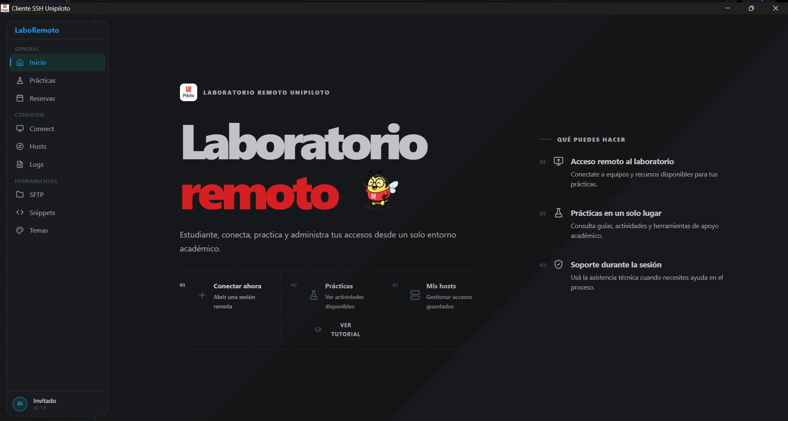
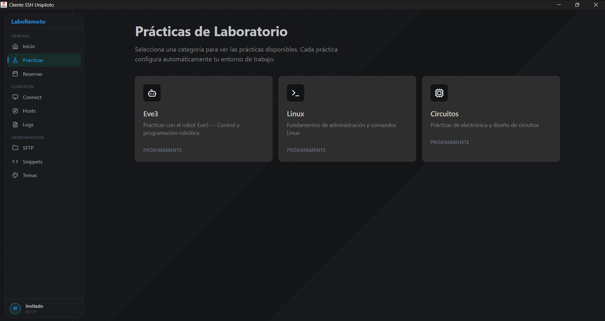
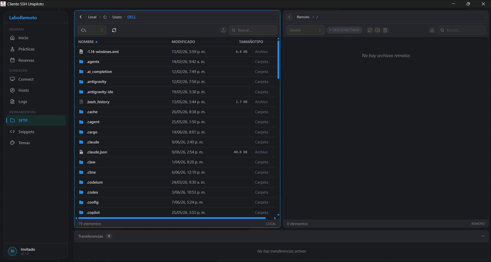
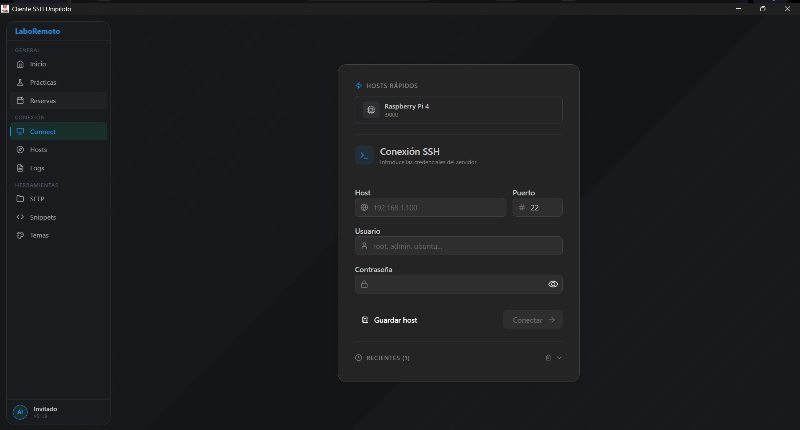

# LaboRemoto

Sistema de laboratorio remoto para educación desarrollado en la **Universidad Piloto de Colombia**. Permite a estudiantes y profesores acceder de forma remota a recursos de hardware y software (Raspberry Pi, Arduino, robots) a través de una aplicación de escritorio moderna con asistencia de IA, terminal SSH, escritorio gráfico remoto y evaluación automática integrada con Moodle.

## Aplicación

La aplicación principal es [Cliente-Rust](./Cliente-Rust), un cliente de escritorio construido con **Tauri** (Rust + React/TypeScript) que proporciona:

- Terminal SSH interactiva con control GPIO
- Transferencia de archivos SFTP
- Chat y agente IA con Claude (Anthropic)
- Escritorio remoto VNC
- Control de Arduino vía bridge HTTP
- Sistema de prácticas de laboratorio con validador automático
- Integración con Moodle LMS
- Streaming de cámaras WebRTC

> La especificación técnica detallada se encuentra en [Cliente-Rust/README.md](./Cliente-Rust/README.md).

## Capturas de referencia

### Inicio



### Prácticas



### SFTP



### Conexión SSH



## Requisitos

- Rust (latest stable)
- Node.js 18+
- Tauri CLI

## Cómo ejecutar

```bash
cd Cliente-Rust
cp .env.example .env   # Configurar ANTHROPIC_API_KEY, MOODLE_URL, etc.
npm install
npm run dev
```

## Arquitectura

```
Frontend (React + TypeScript)
         ↕  invoke() / eventos Tauri
Backend (Rust + Tauri)
         ↕  SSH / SFTP / VNC
Raspberry Pi / Servidor Remoto
```

## Tecnologías principales

| Capa | Tecnología |
|------|-----------|
| Backend | Rust + Tauri |
| Frontend | React + TypeScript |
| IA | Claude (Anthropic) |
| VNC | noVNC + bridge Rust |
| LMS | Moodle REST API |
| IoT | raspi-gpio, Arduino |
| Video | WebRTC / WHEP |
